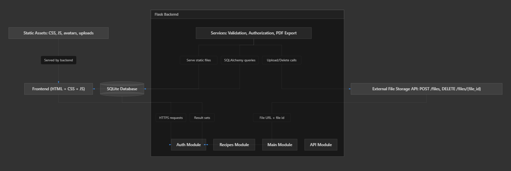
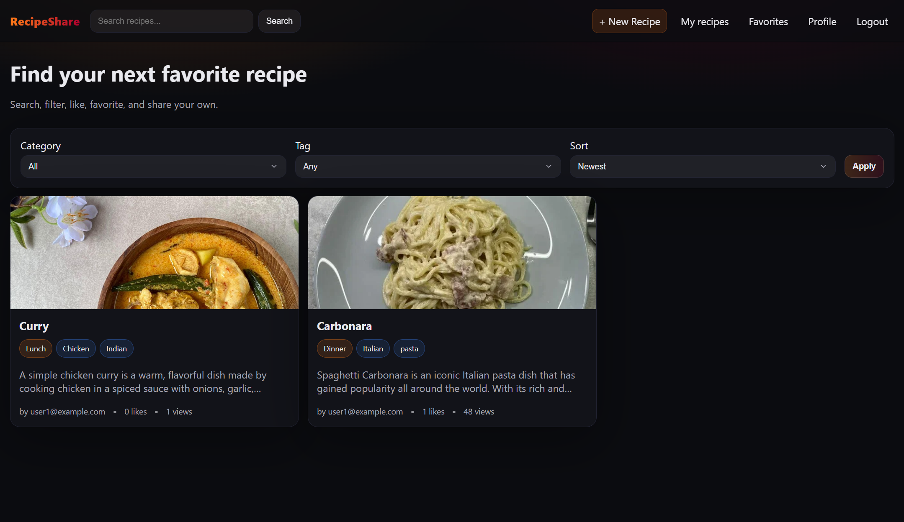
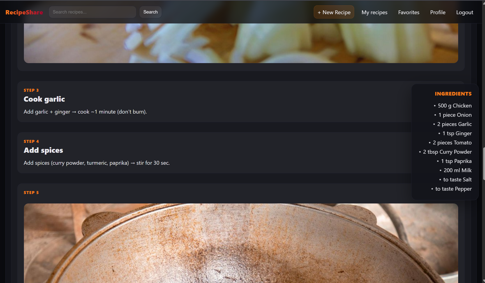
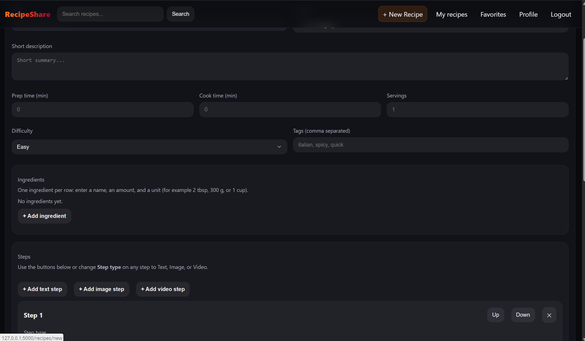
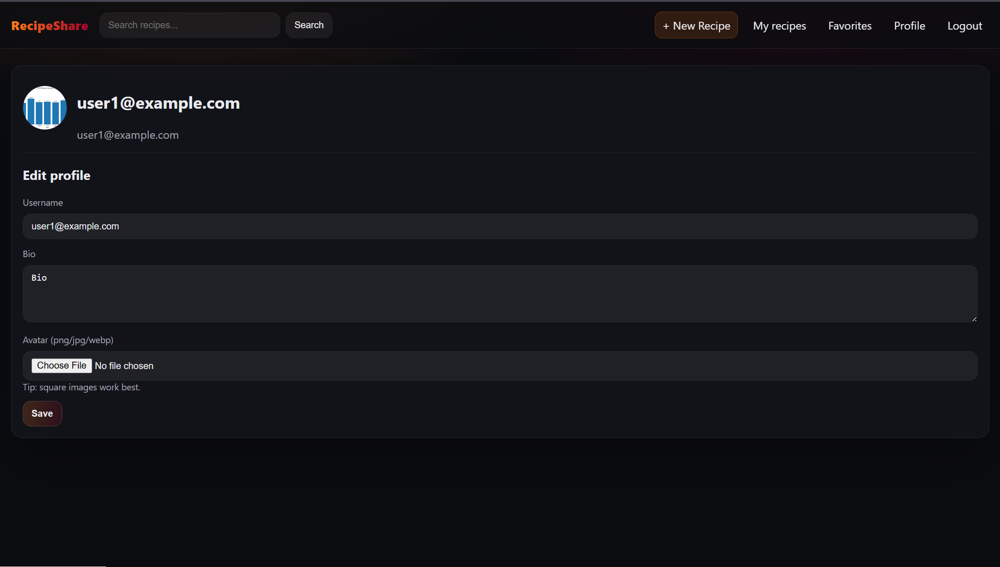

# Recipe Sharing Website

A full-stack web application for publishing, discovering, and saving recipes with a social and community-first user experience.

## Project Description

Many home cooks keep recipes in scattered notes, chat messages, and bookmarks, which makes them hard to organize, search, and share. This project solves that problem by providing a centralized platform where users can create structured recipes, discover new dishes, interact with other cooks, and export recipes for offline use.

## Features and Functionality

### Authentication and Accounts

- User registration, login, and logout
- Password reset with timed token
- User profiles with bio and avatar upload

### Recipe Management

- Create, edit, delete, publish, and unpublish recipes
- Upload recipe media (image/video)
- Download single-recipe PDF from the details page
- Owner and admin authorization for protected actions

### Discovery and Search

- Search recipes by text query
- Filter by category and tag
- Sort by newest or popular
- Paginated recipe feed

### Community and Engagement

- Comment on recipes
- Like recipes
- Save recipes to favorites
- Permission checks for comment deletion (owner/admin)

## Architecture Overview

- **Frontend**: Server-rendered HTML templates with responsive CSS and Vanilla JavaScript for interactive behavior via Fetch API.
- **Backend**: Flask application organized into feature modules (`auth`, `recipes`, `main`, `api`) with form handling, validation, and business logic.
- **API Layer**: Internal Flask API routes for app functionality and integration with an external HTTP file storage API for media upload/delete.
- **Database**: SQLite database accessed through SQLAlchemy ORM for users, recipes, comments, tags/categories, likes, and favorites.



## Tech Stack

- **Frontend**: HTML, CSS, Vanilla JavaScript (Fetch API)
- **Backend**: Python, Flask, Flask-Login, Flask-WTF (CSRF), SQLAlchemy
- **Database**: SQLite
- **External Integration**: HTTP-based file storage API for recipe media
- **Dev Environment**: Python virtual environment

## Setup and Run Instructions

### Prerequisites

- Python 3.10+ (or a compatible Python 3 version)
- `pip` package manager

### 1) Clone and enter the project

```bash
git clone <your-repository-url>
cd recipe_sharing_website
```

### 2) Create and activate a virtual environment

**Windows (PowerShell):**

```powershell
python -m venv .venv
.\.venv\Scripts\Activate.ps1
```

**macOS/Linux:**

```bash
python3 -m venv .venv
source .venv/bin/activate
```

### 3) Install dependencies

```bash
pip install -r requirements.txt
```

### 4) Configure environment variables

Copy template variables:

```bash
cp .env.example .env
```

Then set external file storage values in `.env`:

```bash
FILE_STORAGE_API_BASE_URL=https://your-storage-service.example.com
FILE_STORAGE_API_TOKEN=your-api-token
FILE_STORAGE_TIMEOUT_SECONDS=10
```

### 5) Initialize database (tables and seed data)

```bash
flask --app run.py init-db
```

Optional: create an admin user

```bash
flask --app run.py create-admin
```

### 6) Run the application

```bash
flask --app run.py run
```

Open [http://127.0.0.1:5000/](http://127.0.0.1:5000/) in your browser.

## Screenshots

### Home / Recipe Feed



### Recipe Details



### Create Recipe Form



### User Profile



## Project Structure

```
recipe_sharing_website/
  app/
    __init__.py
    config.py
    extensions.py
    models.py
    utils.py
    auth/
      routes.py
      forms.py
    recipes/
      routes.py
      forms.py
    main/
      routes.py
    api/
      routes.py
    templates/
      base.html
      main/
      auth/
      recipes/
      errors/
    static/
      css/style.css
      js/main.js
      uploads/         (created at runtime)
      avatars/         (created at runtime)
  run.py
  requirements.txt
  README.md
  .env.example
```

## Notes

- Password reset is implemented with a timed token. For simplicity in a course project, the reset URL is printed in the server console. Later a real email provider could be connected.
- New recipe image uploads are sent to the external file storage service with `POST /files` and removed with `DELETE /files/<file_id>`.
- The storage service is expected to return a file identifier and a public URL in its upload response.
- Profile avatars use local storage under `app/static/avatars`.
- Each recipe detail page includes a PDF export download.
- SQLite file is `app.db` by default.


## Demo
[https://drive.google.com/file/d/100pIDnXUU1yXbj9KR1n30Z6w3TSn4BF6/view?usp=sharing](https://drive.google.com/file/d/100pIDnXUU1yXbj9KR1n30Z6w3TSn4BF6/view?usp=sharing)
## Feedback from the professor
[https://drive.google.com/file/d/1_jGbEePVKlUat7d-wNJWcbABZyrJ22O1/view?usp=sharing](https://drive.google.com/file/d/1_jGbEePVKlUat7d-wNJWcbABZyrJ22O1/view?usp=sharing)

